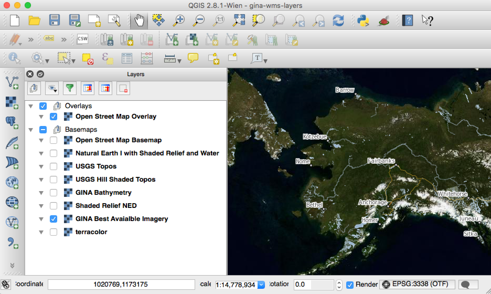

# GINA's Alaskan jump start for QGIS 

A small project to help jump start an Alaskan's QGIS experience.  

Goal: Help an Alaskan new to QGIS and Web Services get up and going with public web map resources ready to go in a QGIS project file.

Here you will find a QGIS project that launches with an Alaskan Albers Equal Area EPSG:3338 projection and a set of public web services to act as orintation and basemap layers.  

_This project is not meant to act as a HOWTO for QGIS or GINA web services._

## Usage

1. Have a copy of QGIS installed on your workstation (out of scope for this repo - at this time).
2. Download a copy of this repository
3. Open up the QGIS Project files and start exploring the pre-setup layers.

## Authors & Contributors

* Dayne Broderson <dayne@alaska.edu>

# Project LICENSE

Unless called out differently below all the content made available in this repository is under the Creative Commons Attribution 4.0 license [CC-BY-4.0](http://creativecommons.org/licenses/by/4.0/) meaning you are free to:

* *Share* — copy and redistribute the material in any medium or format
* *Adapt* — remix, transform, and build upon the material
for any purpose, even commercially.

The licensor cannot revoke these freedoms as long as you follow the license terms.

## Data Services License

Datasets loaded in as webservices provided in this project have their own licensing terms and conditions.  Users of this repository are responsibile for understanding any license restrictions of the datasets they are are using.  

The following is not a comprehensive list of licensing terms for datasets provided through webservices in this project:

* USGS Topos (DRGs) - Public Domain
* NOAA Nautical Charts - Public Domain
* SDMI Ortho - License and copyright restricted as a web services to non-commercial users. Data licensed for Federal, State, Local Government, Tribal Non-Profit, and Academic users with copyright notice requirements. http://alaskamapped.org/ortho
* GINA Best Available Imager - Restricted, Non-commercial, with copyright requirements based on area of focus.

Users with more specific questions on datasets are encouraged to either connect with GINA via support@gina.alaska.edu or submit an issue on this project's [issue tracker](
